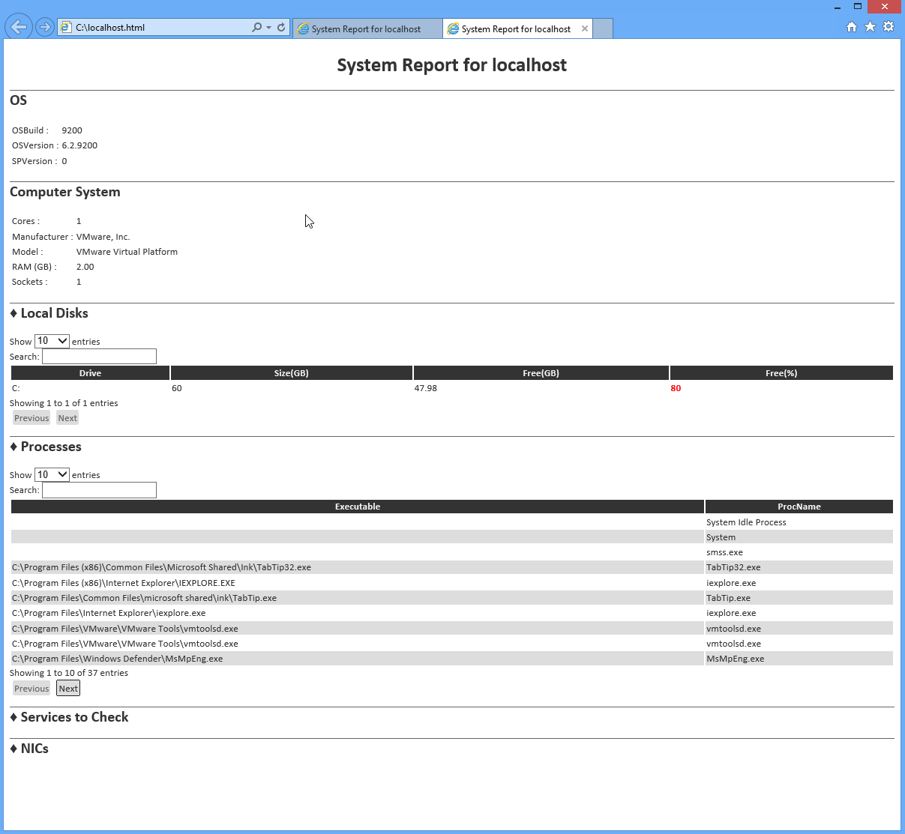

# Construyendo el HTML

Voy a abandonar el CmdLet nativo de ConvertTo-HTML que he discutido hasta ahora, En lugar de eso, voy a pedirle que utilice el módulo EnhancedHTML2 que viene con este e-Book. Tenga en cuenta que, a partir de octubre de 2013, se trata de una nueva versión del módulo - es más sencillo que el módulo EnhancedHTML introducido con la edición original de este libro.

Comencemos con el script que utiliza el módulo. Se incluye con este libro como EnhancedHTML2-Demo.ps1, por lo que aquí voy a pegarlo aquí y luego agregare las explicaciones sobre lo que hace cada bit. Tenga en cuenta que no puedo controlar cómo se ve el código en un e-Reader, por lo que es probable que parezca un poco desordenado.

```
#requires -module EnhancedHTML2
<#
.SYNOPSIS
Generates an HTML-based system report for one or more computers.
Each computer specified will result in a separate HTML file; 
specify the -Path as a folder where you want the files written.
Note that existing files will be overwritten.

.PARAMETER ComputerName
One or more computer names or IP addresses to query.

.PARAMETER Path
The path of the folder where the files should be written.

.PARAMETER CssPath
The path and filename of the CSS template to use. 

.EXAMPLE
.\New-HTMLSystemReport -ComputerName ONE,TWO `
                       -Path C:\Reports\ 
#>
[CmdletBinding()]
param(
    [Parameter(Mandatory=$True,
               ValueFromPipeline=$True,
               ValueFromPipelineByPropertyName=$True)]
    [string[]]$ComputerName,

    [Parameter(Mandatory=$True)]
    [string]$Path
)
```

La sección anterior nos dice que se trata de un "script avanzado", lo que significa que utiliza el enlace de CmdLet de PowerShell. Puede especificar uno o más nombres de equipo para los que se genera el informe, y debe especificar una ruta de acceso de carpeta (no un nombre de archivo) para almacenar los reportes finales.

```
BEGIN {
    Remove-Module EnhancedHTML2
    Import-Module EnhancedHTML2
}
```

El bloque BEGIN podría ser eliminado dependiendo de la versión de PowerShell que esté utilizando. Utilizo esta demostración para probar el módulo, así que es importante que descargue cualquier versión antigua de la memoria (si ha cargado el módulo anteriormente) y vuelva a cargar la versión revisada. De hecho, PowerShell v3 y posterior no requerirá la importación si el módulo está correctamente ubicado en `\Documents\WindowsPowerShell\Modules\EnhancedHTML2`.

```
PROCESS {

$style = @"
<style>
body {
    color:#333333;
    font-family:Calibri,Tahoma;
    font-size: 10pt;
}

h1 {
    text-align:center;
}

h2 {
    border-top:1px solid #666666;
}

th {
    font-weight:bold;
    color:#eeeeee;
    background-color:#333333;
    cursor:pointer;
}

.odd  { background-color:#ffffff; }

.even { background-color:#dddddd; }

.paginate_enabled_next, .paginate_enabled_previous {
    cursor:pointer; 
    border:1px solid #222222; 
    background-color:#dddddd; 
    padding:2px; 
    margin:4px;
    border-radius:2px;
}

.paginate_disabled_previous, .paginate_disabled_next {
    color:#666666; 
    cursor:pointer;
    background-color:#dddddd; 
    padding:2px; 
    margin:4px;
    border-radius:2px;
}

.dataTables_info { margin-bottom:4px; }

.sectionheader { cursor:pointer; }

.sectionheader:hover { color:red; }

.grid { width:100% }

.red {
    color:red;
    font-weight:bold;
} 
</style>
"@
```

Eso se llama hoja de estilos en cascada, o CSS. Hay algunas cosas interesantes para sacar destacar:

He colocado toda la sección `<style></ style>` en una cadena [here-string de PowerShell]( https://goo.gl/exzNGQ), y almacenado en la variable $style. Hará que sea fácil referirse a esto en adelante.

Tenga en cuenta que he definido el estilo de varias etiquetas HTML, como H1, H2, BODY y TH. Esas definiciones de estilo listan el nombre de la etiqueta sin un signo anterior de período o hash. Se definen los elementos de estilo que interesan, como el tamaño de la fuente, la alineación del texto, etc. Etiquetas como H1 y H2 ya tienen estilos predefinidos establecidos por su navegador, como su tamaño de fuente. Cualquier cosa que ponga en el CSS reemplazará los valores predeterminados del navegador.

Los estilos también heredan. Todo el cuerpo de la página HTML está contenido dentro de las etiquetas `<BODY></ BODY>`, por lo que cualquier cosa que asigne a la etiqueta BODY en CSS también se aplicará a todo lo que contenga la página. Mi cuerpo establece una familia de fuentes y un color de fuente. Las etiquetas H1 y H2 usarán la misma fuente y color.

También verá las definiciones de estilo precedidas por un punto. Esos se llaman estilos de clase. Son clase de plantillas reutilizables del estilo que se pueden aplicar a cualquier elemento dentro de la página. Los ".paginate" son realmente utilizados por el JavaScript que uso para crear tablas dinámicas. No me gustó la forma en que los botones Prev / Next se veían fuera de la caja, así que modifiqué mi CSS para aplicar estilos diferentes.

Preste mucha atención a .odd, .even, y .red en el CSS. Vera que los utilizo poco a poco.

```
function Get-InfoOS {
    [CmdletBinding()]
    param(
        [Parameter(Mandatory=$True)][string]$ComputerName
    )
    $os = Get-WmiObject -class Win32_OperatingSystem -ComputerName $ComputerName
    $props = @{'OSVersion'=$os.version
               'SPVersion'=$os.servicepackmajorversion;
               'OSBuild'=$os.buildnumber}
    New-Object -TypeName PSObject -Property $props
}

function Get-InfoCompSystem {
    [CmdletBinding()]
    param(
        [Parameter(Mandatory=$True)][string]$ComputerName
    )
    $cs = Get-WmiObject -class Win32_ComputerSystem -ComputerName $ComputerName
    $props = @{'Model'=$cs.model;
               'Manufacturer'=$cs.manufacturer;
               'RAM (GB)'="{0:N2}" -f ($cs.totalphysicalmemory / 1GB);
               'Sockets'=$cs.numberofprocessors;
               'Cores'=$cs.numberoflogicalprocessors}
    New-Object -TypeName PSObject -Property $props
}

function Get-InfoBadService {
    [CmdletBinding()]
    param(
        [Parameter(Mandatory=$True)][string]$ComputerName
    )
    $svcs = Get-WmiObject -class Win32_Service -ComputerName $ComputerName `
           -Filter "StartMode='Auto' AND State<>'Running'"
    foreach ($svc in $svcs) {
        $props = @{'ServiceName'=$svc.name;
                   'LogonAccount'=$svc.startname;
                   'DisplayName'=$svc.displayname}
        New-Object -TypeName PSObject -Property $props
    }
}

function Get-InfoProc {
    [CmdletBinding()]
    param(
        [Parameter(Mandatory=$True)][string]$ComputerName
    )
    $procs = Get-WmiObject -class Win32_Process -ComputerName $ComputerName
    foreach ($proc in $procs) { 
        $props = @{'ProcName'=$proc.name;
                   'Executable'=$proc.ExecutablePath}
        New-Object -TypeName PSObject -Property $props
    }
}

function Get-InfoNIC {
    [CmdletBinding()]
    param(
        [Parameter(Mandatory=$True)][string]$ComputerName
    )
    $nics = Get-WmiObject -class Win32_NetworkAdapter -ComputerName $ComputerName `
           -Filter "PhysicalAdapter=True"
    foreach ($nic in $nics) {      
        $props = @{'NICName'=$nic.servicename;
                   'Speed'=$nic.speed / 1MB -as [int];
                   'Manufacturer'=$nic.manufacturer;
                   'MACAddress'=$nic.macaddress}
        New-Object -TypeName PSObject -Property $props
    }
}

function Get-InfoDisk {
    [CmdletBinding()]
    param(
        [Parameter(Mandatory=$True)][string]$ComputerName
    )
    $drives = Get-WmiObject -class Win32_LogicalDisk -ComputerName $ComputerName `
           -Filter "DriveType=3"
    foreach ($drive in $drives) {      
        $props = @{'Drive'=$drive.DeviceID;
                   'Size'=$drive.size / 1GB -as [int];
                   'Free'="{0:N2}" -f ($drive.freespace / 1GB);
                   'FreePct'=$drive.freespace / $drive.size * 100 -as [int]}
        New-Object -TypeName PSObject -Property $props 
    }
}
```

Las seis funciones anteriores no hacen otra cosa que recuperar datos de una sola computadora (observe que su parámetro -ComputerName se define como `[string]`, aceptando un valor, en lugar de `[string[]]` que aceptaría múltiples). Si no logra entender cómo funciona esto... es probable que tenga que dar un paso atrás!

Para propósitos de formato, usted está viendo que se utiliza el carácter (back tick) (como en –ComputerName y $ComputerName). En PowerShell este carácter funciona como una especie de continuación de línea. Lo señalo porque puede ser fácil perderlo de vista.

```
foreach ($computer in $computername) {
    try {
        $everything_ok = $true
        Write-Verbose "Checking connectivity to $computer"
        Get-WmiObject -class Win32_BIOS -ComputerName $Computer -EA Stop | Out-Null
    } catch {
        Write-Warning "$computer failed"
        $everything_ok = $false
    }
```

Lo anterior es el inicio de mi script de demostración. Se están tomando los nombres de equipo que se pasaron al parámetro `-ComputerName`, procesándolos uno a la vez. Luego se hace una llamada a `Get-WmiObject` como una prueba - si esto falla, no quiero hacer nada con el nombre del equipo en absoluto. El resto de la secuencia de comandos sólo se ejecuta si esa llamada WMI tiene éxito.

```
 if ($everything_ok) {
        $filepath = Join-Path -Path $Path -ChildPath "$computer.html"
```

Recuerde que el otro parámetro de este script es `-Path`. Estoy utilizando `Join-Path` para combinar $Path con un nombre de archivo. Join-Path garantiza el número correcto de barras inversas, de modo que si `-Path` es "C:" o "C:" obtendré una ruta de archivo válida. El nombre de archivo será el nombre del equipo actual, seguido de la extensión .html.

```
        $params = @{'As'='List';
                    'PreContent'='<h2>OS</h2>'}
        $html_os = Get-InfoOS -ComputerName $computer |
                   ConvertTo-EnhancedHTMLFragment @params

```

Aquí está mi primer uso del módulo EnhancedHTML2: Con ConvertTo-EnhancedHTMLFragment. Observe lo que estoy haciendo:

1. Estoy usando un hashtable para definir los parámetros del comando, incluyendo ambos -As List y -PreContent '`<H2>OS</H2>`' como parámetros y sus valores. Esto especifica una salida de estilo de lista (frente a una tabla), precedida por el encabezado "OS" en el estilo H2. Vuelva a mirar el CSS y verá que he aplicado un borde superior a todo el elemento `<H2>`, lo que ayudará a separar visualmente las secciones de mi informe.

2. Estoy ejecutando mi comando Get-InfoOS, pasando el nombre del equipo actual. La salida se canaliza a...

3. ConvertTo-EnhancedHTMLFragment, ConvertTo-EnhancedHTMLFragment, donde se encuentra mi hashtable de parámetros. El resultado será una gran cadena de HTML, que se almacenará en $html\_os.

```
        $params = @{'As'='List';
                    'PreContent'='<h2>Computer System</h2>'}
        $html_cs = Get-InfoCompSystem -ComputerName $computer |
                   ConvertTo-EnhancedHTMLFragment @params 
```

Ese es un ejemplo similar, para la segunda sección de mi informe..

```
        $params = @{'As'='Table';
                    'PreContent'='<h2>&diams; Local Disks</h2>';
                    'EvenRowCssClass'='even';
                    'OddRowCssClass'='odd';
                    'MakeTableDynamic'=$true;
                    'TableCssClass'='grid';
                    'Properties'='Drive',
               @{n='Size(GB)';e={$_.Size}},
               @{n='Free(GB)';e={$_.Free};css={if ($_.FreePct -lt 80) { 'red' }}},
               @{n='Free(%)';e={$_.FreePct};css={if ($_.FreeePct -lt 80) { 'red' }}}}
        
        $html_dr = Get-InfoDisk -ComputerName $computer |
                   ConvertTo-EnhancedHTMLFragment @params
```

OK, ese es un ejemplo más complejo. Echemos un vistazo a los parámetros que estoy pasando a ConvertTo-EnhancedHTMLFragment:

- Como se está produciendo una tabla en lugar de una lista, la salida será en un diseño de tabla columnar (algo como lo que produciría Format-Table, pero en HTML).

- Para mi sección de encabezado, he añadido un símbolo de diamante utilizando la entidad HTML &diams; Creo que se ve bien. Eso es todo.

- Puesto que esto será una tabla, puedo especificar -EvenRowCssClass y -OddRowCssClass. Le doy los valores "even" y "odd", que son las dos clases (.even y .odd) que definí en mi CSS. De esta forma estoy creando el vínculo entre las filas de la tabla y mi CSS. Cualquier fila de la tabla "etiquetada" con la clase "odd" heredará el formato de ".odd" de mi CSS. No se debe incluir el punto al especificar los nombres de clase con estos parámetros. Sólo en el CSS se coloca el punto delante del nombre de la clase.

- `-MakeTableDynamic` se establece en $True, para que se aplique el JavaScript necesario y convertir la salida en una tabla que se pueda ordenar y paginar. Esto requerirá que el HTML final se vincule al archivo JavaScript necesario, pero cubriremos este punto cuando lleguemos allí.

- `-TableCssClass` es opcional, pero lo estoy usando para asignar la clase "grid". Una vez más, si observa el CSS, podrá observar que definí un estilo para ".grid", por lo que esta tabla heredará esas instrucciones de estilo.

- El último es el parámetro `-Properties`. Funciona muy parecido a los parámetros `-Properties` de `Select-Object` y `Format-Table`. El parámetro acepta una lista de propiedades separada por comas. El primero, Drive, ya está siendo producido por `Get-InfoDisk`. Los siguientes tres son especiales: son hashtables, creando columnas personalizadas como loa haría Format-Tabl. Dentro del hashtable, usted puede utilizar las siguientes claves:

  - n (o name, o l, o label) especifica el encabezado de columna. Estoy usando "Size(GB)," "Free(GB)", y "Free(%)" como encabezados de columna.
  
  - e (o expression) es un bloque de secuencia de comandos, que define lo que contendrá la celda de la tabla. Dentro de ella, puede utilizar $\_ para referirse al objeto de entrada. En este ejemplo, el objeto canalizado proviene de `Get-InfoDisk`, por lo que me refiero a las propiedades Size, Free y FreePct del objeto. 
  
  - css (o cssClass) es también un bloque de secuencia de comandos. Mientras que el resto de las claves funcionan igual que lo hacen con Select-Object o Format-Table, css (o cssClass) es exclusivo de ConvertTo-EnhancedHTMLFragment. Acepta un bloque de secuencia de comandos, que se espera que produzca una cadena, o nada. En este caso, estoy comprobando para ver si la propiedad FreePct del objeto en la canalización es menor que 80 o no. Si es así, la salida será la cadena "red". Esta cadena se agregará como una clase CSS de la celda en la tabla. Recuerde que en mi CSS definí la clase ".red" y aquí es donde adjunto esa clase a las celdas de la tabla.
  
  - Como una nota aparte, me doy cuenta de que es tonto establecer un color rojo cuando el porcentaje libre de disco es inferior al 80%. Se trata solo de un ejemplo para jugar. Podría fácilmente tener una fórmula más compleja, como _if ($\_.FreePct -lt 20) { 'red' } elseif ($\_.FreePct -lt 40) { 'yellow' } else { 'green' }_ y entonces habría definido las clases ".red", ".yellow" y ".green" en el CSS.

```
$params = @{'As'='Table';
                          'PreContent'='<h2>&diams; Processes</h2>';
                          'MakeTableDynamic'=$true;
                          'TableCssClass'='grid'}
$html_pr = Get-InfoProc -ComputerName $computer |
                              ConvertTo-EnhancedHTMLFragment @params 

$params = @{'As'='Table';
                          'PreContent'='<h2>&diams; Services to Check</h2>';
                          'EvenRowCssClass'='even';
                          'OddRowCssClass'='odd';
                          'MakeHiddenSection'=$true;
                          'TableCssClass'='grid'}
       
 $html_sv = Get-InfoBadService -ComputerName $computer |
                               ConvertTo-EnhancedHTMLFragment @params 
```

Más de lo mismo en los dos ejemplos anteriores, con sólo un nuevo parámetro: -MakeHiddenSection. Esto hará que la sección del informe se colapse de forma predeterminada, mostrando sólo la cadena -PreContent. Al hacer clic en la cadena, se expandirá y contraerá la sección del informe.

De regreso en mi CSS, observe que para la clase .sectionHeader, establezco el cursor en un icono de puntero, e hice que el color del texto de la sección fuera rojo cuando el ratón pasa sobre él. Esto ayuda a comprender al usuario que se puede hacer clic en el encabezado de la sección. El módulo EnhancedHTML2 siempre agrega la clase CSS "sectionheader" al -PreContent, por lo que al definir ".sectionheader" en su CSS, puede seguir diseñando los encabezados de sección.

```
        $params = @{'As'='Table';
                    'PreContent'='<h2>&diams; NICs</h2>';
                    'EvenRowCssClass'='even';
                    'OddRowCssClass'='odd';
                    'MakeHiddenSection'=$true;
                    'TableCssClass'='grid'}
        $html_na = Get-InfoNIC -ComputerName $Computer |
                   ConvertTo-EnhancedHTMLFragment @params
```

Nada nuevo en el fragmento anterior, pero ahora estamos listos para generar el HTML final:

```
        $params = @{'CssStyleSheet'=$style;
                    'Title'="System Report for $computer";
                    'PreContent'="<h1>System Report for $computer</h1>";
            'HTMLFragments'=@($html_os,$html_cs,$html_dr,$html_pr,$html_sv,$html_na);
                    'jQueryDataTableUri'='C:\html\jquerydatatable.js';
                    'jQueryUri'='C:\html\jquery.js'}
        ConvertTo-EnhancedHTML @params |
        Out-File -FilePath $filepath

        <#
        $params = @{'CssStyleSheet'=$style;
                    'Title'="System Report for $computer";
                    'PreContent'="<h1>System Report for $computer</h1>";
            'HTMLFragments'=@($html_os,$html_cs,$html_dr,$html_pr,$html_sv,$html_na)}
        ConvertTo-EnhancedHTML @params |
        Out-File -FilePath $filepath
        #>
    }
}

}
```

El código no comentado y el código comentado hacen lo mismo. El primero, no comentado, establece una ruta de archivo local para los dos archivos JavaScript necesarios. El comentado no especifica esos parámetros, por lo que el código HTML final utilizará el JavaScript desde la Red de distribución de contenido (CDN) basada en la Web de Microsoft. En ambos casos:

- -CssStyleSheet especifica mi CSS - estoy alimentando mi variable predefinida $style. También puede vincular a una hoja de estilo externa (hay un parámetro diferente, -CssUri, para eso), pero tener el estilo incrustado en el HTML lo hace más autónomo.

- -Title especifica qué se mostrará en la barra de título del navegador o pestaña.

- -PreContent, que estoy definiendo mediante las etiquetas HTML `<H1>`, aparecerá en la parte superior del informe. También hay un -PostContent si desea agregar un pie de página.

- -HTMLFragments requiere una matriz (de ahí el uso de @ () para crear una matriz) de fragmentos HTML producidos por ConvertTo-EnhancedHTMLFragment. Así estoy alimentando las 6 secciones del informe HTML que creé anteriormente. 

El resultado final se canaliza a la ruta de archivo que creé anteriormente. Así se ve el resultado:



Tengo mis últimas dos secciones contraidas. Observe que la lista de procesos está paginada, con los botones Previous/Next y además mi disco sin el 80% está resaltado en rojo. Las tablas muestran 10 filas por defecto, pero se pueden hacer más grandes, y ofrecen un cuadro de búsqueda incorporado. Se puede hacer clic sobre los encabezados de columna para ordenar.

¡Francamente, creo que se ve extraordinario!
