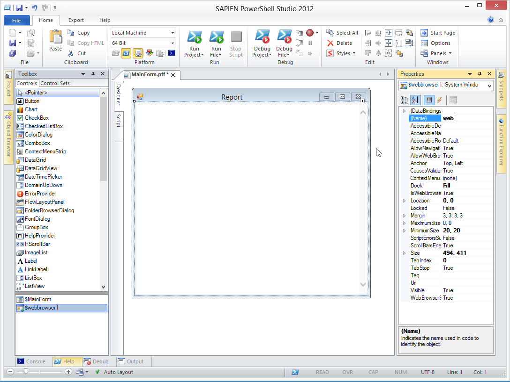
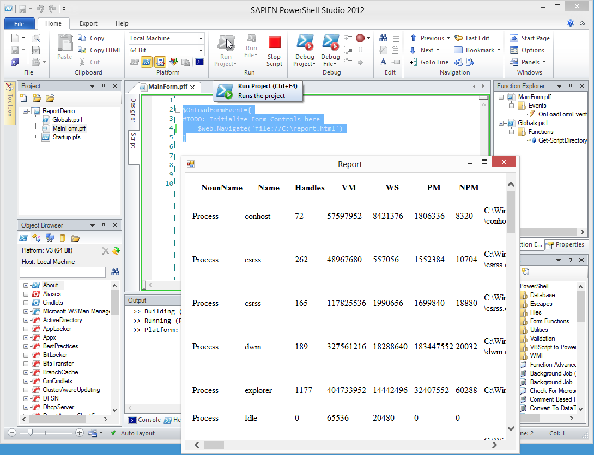

# Combinación de informes HTML y una aplicación GUI

He tenido un buen número de personas haciendo preguntas en los foros en PowerShell.org, con el asunto "¿cómo puedo utilizar un RichTextBox en una aplicación GUI de Windows para mostrar datos en un formato agradable?" Mi respuesta es no lo haga. Utilice HTML en su lugar. Por ejemplo, digamos que siguió los ejemplos del capítulo anterior y produjo un hermoso informe HTML. Tenga en cuenta que el informe permanece "en memoria", no en un archivo de texto, hasta el final:

```
      $params = @{'CssStyleSheet'=$style;
                    'Title'="System Report for $computer";
                    'PreContent'="<h1>System Report for $computer</h1>";
                    'CssIdsToMakeDataTables'=@('tableProc','tableNIC','tableSvc');
                    'HTMLFragments'=@($html_os,$html_cs,$html_pr,$html_sv,$html_na)}
        ConvertTo-EnhancedHTML @params |
        Out-File -FilePath $filepath
```

Por razones de ilustración, digamos que ahora está en un archivo llamado C:\Report.html. Voy a usar PowerShell Studio 2012 de SAPIEN para mostrar ese informe en una GUI, en lugar de hacerla aparecer en un navegador Web. Entonces, he iniciado con un proyecto simple, de una sola forma. He cambiado el texto del formulario a "Informe", y he añadido un control WebBrowser desde la caja de herramientas. Ese control llena automáticamente la forma entera, así que está perfecto. Nombré el control de WebBrowser "web", lo que hará accesible desde el código a través de la variable $web.

Cabe resaltar que PowerShell Studio 2012 podría estar muy desfasado en el momento que lea esto, pero todavía debería tener la idea general.



Espero que haga un formulario como parte de un proyecto general más grande. Por ahora solo me voy a enfocar en solucionar este problema. Así que voy a cargar la información del reporte en el control WebBrowser cuando el formulario se cargue:

```
$OnLoadFormEvent={
#TODO: Initialize Form Controls here
    $web.Navigate('file://C:\report.html')
} 
```

Ahora puedo ejecutar el proyecto:



Obtengo un agradable cuadro de diálogo emergente que muestra el informe HTML. Puedo cambiar el tamaño, minimizarlo, maximizarlo y cerrarlo usando los botones estándar en la barra de título de la ventana. Fácil, y sólo tomó 5 minutos.
